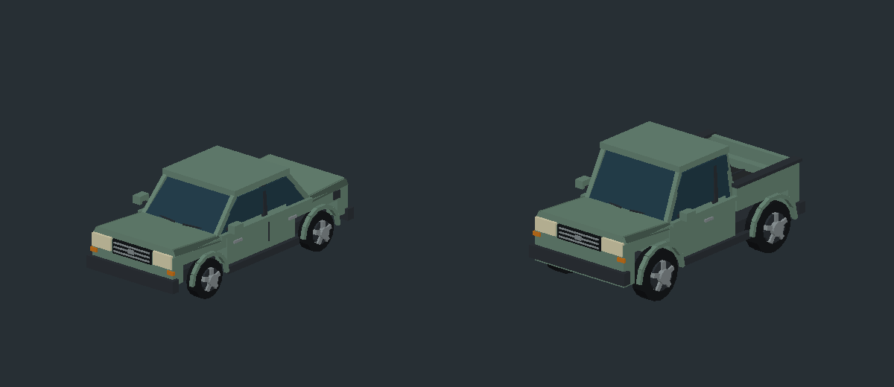

# LiveRound — consolidated change report

Updated 2026-09-09. This is the single current update list and AI handoff. It supersedes the previous world-pass, publish-prep, Shoothouse, agent, progress and debug handoffs, including the historical paintball-insanity review. Older narratives and their superseded numbers remain in Git history; they are not current instructions.

## Second pass, 2026-09-09 — five more

Separate from the five below, which were a different session's. Nothing here changed a balance threshold.

| Area | Before | Current behavior | Verification |
| --- | --- | --- | --- |
| Bot silhouette vs hitbox | A pro's bump helmet reached 1.850 m and stowed night vision 1.805 m, against a hit capsule that stops at 1.800. Paint landing on the crown of a helmet the player could see did not register. | The shell is lowered to y=0.065 and widened to 0.42 x 0.44 so it still reads as a helmet over the narrower mask beneath it; the NVG tubes drop to y=0.165. Every combatant now tops out at 1.795 m. Nothing on a body stands outside the shape the server shoots at. | `tools/probe-hitbox`: botPro and botMarshal both 1.850 -> 1.795. `check-characters` passes. |
| Trading benchmark | `Policies.human` — the *holding* policy `probe-trading` measures — still walked to the world origin and idled, while only `competent` had been fixed. Once the movement freeze was lifted, "holding an angle" meant walking into the middle of the map and standing in the open, and rushing beat holding on **four of five fields**. | One `advanceToContact` shared by every policy, so `human` and `rusher` reach contact identically and the probe measures the fight rather than the walk. | `probe-trading`: Urban (-3.67 -> +0.33) and Woods (-7.50 -> +0.17) restored. Three fields still invert; see Known gaps. |
| Season track visibility | The Season 1 pass shipped with no way for a client to see it. `SeasonPass.summary` was called on the server and the value reached nothing. | The track goes out with the shop payload and the barn draws it: season name, tier x/20, marks to the next tier, and whether the paid column is unlocked. The barn is where a player stands when they think about spending. | `check-client-ui` passes with the new label. |
| Bot chatter pacing | `maxLinesPerMinute` was 9 while the rec tier declared 11, and `Chatter` takes `math.min` of the two — so rec was silently clamped to amateur's rate and the two tiers sounded identical. | Ceiling raised to 11 so the per-tier table is the actual control. A rec squad will not shut up; a pro squad barely speaks, which is the design the table was written for. | `ship-check` and `run-live-checks` pass. |
| Handoff documents | Six separate handoff, progress and debug narratives with overlapping and contradictory numbers. | All superseded by this file; each old path is a stub pointing here. | Stub check on all six. |

**Debug rerun after these changes: 18 of 19 gates pass, 489 specs pass, the same 2 balance specs fail** (373.30 s). No new failure introduced.

## Latest five improvements

| Area | Before | Current behavior | Verification |
| --- | --- | --- | --- |
| First-person render order | Input camera offsets, the marker and HUD shared an unordered RenderStepped callback with Roblox's camera. | Input updates immediately before the default camera; marker/HUD/automatic fire use the updated camera immediately afterward. This removes the ordering risk behind one-frame marker lag. | Current Roblox render-priority API checked; source compiles. Final camera feel needs playtesting. |
| Movement input | Cancel events could leave sprint/crouch active; crouching out of sprint skipped recovery; releasing one lean key forgot the other; jumping counted as horizontal movement. | End and Cancel release held actions, all sprint exits preserve recovery, opposing lean keys compose correctly, and stance uses horizontal speed. Respawn waits for the actual Humanoid. Exponential camera smoothing behaves consistently across frame rates. | Cancellation, overlap, recovery, vertical velocity and matched 30/120 Hz smoothing checks pass. |
| Paint effects | A recycled splat's old delayed callback could remove new paint early. Disabling a Trail left old history behind. Effects could carry into another round. | One expiry clock replaces per-splat delayed tasks; recycled splats get a fresh lifetime; Trail history is explicitly cleared. Pools cap at 120 splats and 96 flying tracers. Round changes, respawns and summaries clear effects. The effects folder lives independently of camera replacement. | Long-burst recycling, expiry, trail clearing, hard cap and repeated cleanup checks pass. |
| Bot animation timing | Gait speed divided distance by CPU elapsed time. Multiple fixed simulation ticks in one Heartbeat could look like a speed spike. | Avatar posing receives the simulation timestep. Identical movement produces identical poses whether ticks arrive normally or back-to-back. Character designs and collision rules are unchanged by this fix. | Opposed-leg gait checks and normal-vs-catch-up pose comparisons pass. |
| Map collision queries | Every visibility ray searched for the nearest hit, recomputed rotation trigonometry and allocated axis tables. | Visibility stops at the first blocker; projectile impacts still find the nearest. Static volume rotations are cached, irrelevant volumes are rejected early, and scalar clipping removes per-axis tables. | 5,000 seeded rays / 15,000 comparisons against an exhaustive reference pass across all five maps, including ignored cover, concealment and inside/zero-length segments. |

A same-process benchmark of those 15,000 queries measured a median **1.292 s before / 0.858 s after: 33.6% less query CPU time**. This is a Lune microbenchmark, not a measured in-game FPS improvement. No balance assertions or thresholds were changed.

Key implementation files: `Client/init.client.luau`, `Client/Input.luau`, `Client/Tracers.luau`, `Match/BotAvatar.luau`, `Match/MatchService.luau`, `Shared/MapGeometry.luau`, and `Data/clientEffects.json`.

## Debug result and builds

The full debug rerun completed: **18 of 19 gates passed; 489 specs passed and the same two balance specs failed** (332.99 seconds for the spec suite). New input, paint, gait, collision, map and live-service checks pass. The follow-up rerun against the concurrently updated simulator policy also finished: **22 passed / the same two failed** across Sim, SimReload and SimSpread (358.07 seconds). No new failure was introduced by the five fixes.

- `build/paintball-release.rbxlx`: current full project for Studio playtesting; built successfully.
- `build/paintball-demo.rbxlx`: explicit temporary-progress demo; built successfully.
- `build/environment-review.rbxlx`: static, generated Landing for inspecting actual environment assets; no game scripts.
- `build/debug-results.txt`: complete full-run output plus the current-policy follow-up and collision benchmark.
- `tools/check-all.luau`: one authoritative list of 19 automated gates, including the new collision comparison gate.

The current environment review was opened in Studio, but the captured viewport remained blank in this automation session. There is no rendered approval, controller acceptance or device FPS claim for these changes. The user's next full playtest remains necessary. No place was published.

## Current game and release decisions

- **Paintball throughout:** one mark is out, no health/damage/armour system, no realistic injury. Server code decides hits, ammo, rewards and progression. Cosmetics cannot improve accuracy.
- **Gauntlet and Shoothouse are integrated.** `Data/gamemodes.json` is authoritative; the default is Gauntlet. Horde, Capture the Flag and marshal/boss encounters have rules/data but remain deferred from live play. Old handoffs saying Shoothouse is unreachable are obsolete.
- **Five Gauntlet rounds:** 4, 6, 8, 10 and 12 bots; the final two raise tier by one, capped at pro. Outs accumulate across the match. A partial clear earns only its ordinary round share; it cannot earn full-match/flawless progression.
- **Shoothouse:** four stages, two waves per stage, checkpoint respawns, one run clock, medal records and a time penalty for getting marked. The live-service check drives its entry point through completion and confirms the profile record.
- **Two-player co-op is authorized but not implemented.** The intended place setting is MaxPlayers=2; the server currently refuses a second simultaneous match. A second seat is not a shared course. Do not describe co-op as playable.
- **Map scale:** Speedball/Urban remain full size; Dustline/Woods/Holdfast are at 88%. Speedball cycles six authored spawns for larger squads. Live repeated spawns fan out; simulator spawn stacking remains a parity limitation.
- **Free supply remains active.** `freeMode=true`, `shopFree=true`, `paidEnabled=false`; marketplace IDs stay zero. Effective prices are zero. `Data/dev.json` has `enabled=false`; nested override switches have no effect while the master switch is off. Earned camos and campaign milestones remain skill-gated.
- **Saves:** pinned, licensed ProfileStore is vendored. Published servers require actual DataStore access and session ownership. Ordinary Studio uses ProfileStore.Mock; DemoMode uses explicit temporary storage and is refused outside Studio. Wally is not required merely to build the vendored release.
- **Field kit/consumables:** catalogued previews with retained inventory, but live effects/activation are not implemented. Server purchasing/claiming of unavailable kit is refused.
- **The Range is live.** It runs authoritative drills/scoring and intentionally pays nothing. It is no longer a sign leading to a missing feature.

## Accumulated visual and feel changes

### Combat, markers and controls

- Procedural first-person reload lifts/cants the marker, opens the hopper, brings in a pod, pours, withdraws and closes the lid. Timing follows the equipped marker's reload duration; no uploaded animation is required.
- Sprint tucks the marker and drives bob from distance travelled. A stationary held sprint does not bob. Slide adds a grounded sprint-gated marker pose and eased eye drop using existing speed/duration/cooldown. Slide does not shrink the authoritative hitbox or add clearance under obstacles.
- Marker archetypes have distinct hardware: mechanical stack/bolt details, compact electronic components and a pump forend. Cylindrical tanks/hoppers, barrel steps, porting and a visible bore replace the original blobs.
- Nine marker variants, including five Yardline colourways and the Aurum Kompressor, share audited baseline accuracy. Reactive panels pulse only on confirmed mask tags; first camo auto-equip preserves later player choices.
- Four early reactive camo milestones are 10/35/75/150 confirmed mask tags; later finishes use 250/500/1000. Campaign rewards remain separate earned milestones. Reload/ammo prediction does not refill merely because a cosmetic changes.
- Vertical FOV is 78 degrees. HUD spread and holdover graphics derive from the actual camera FOV/viewport; range readouts are throttled rather than raycast/formatted every rendered frame.
- Shop, dialogue and results use responsive scrolling layouts, safe insets, explicit controller selection/navigation, and close handling that releases gameplay input. Timer generations prevent older banners/hit flashes/chatter from erasing newer ones.

| Action | Keyboard/mouse | Controller |
| --- | --- | --- |
| Move / aim | WASD / mouse | Sticks |
| Fire | Left mouse | R2 |
| Reload | R | X |
| Sprint | Left Shift | L3 |
| Crouch | Left Control | B |
| Slide during grounded sprint | C | R1 |
| Lean | Q / E | D-pad left / right |

### Vehicles, props, shop and characters

- Urban's four cover cars carry sedan assemblies; the Landing's trucks carry pickup bodies with open beds. Sloped windows, separate pillars, wheel arches, tires/rims, bumpers, grilles, lights, mirrors and trim replace block silhouettes.
- Sedan: 120 visual parts. Pickup: 125. Windows are opaque; only major panels/tires cast shadows. Vehicles are static props. Gameplay retains the authored simple car/bed/cab colliders, including the filled rectangular space under a car.
- Picnic tables, pallet stacks and air racks now use boards/braces, tank valves, retention bands, gauges and cargo straps.
- The barn roof/rafters now rise to a proper ridge. Gable infill, overhangs, sign brackets and bay signs follow the corrected roofline. The three supply bays have racks, stocked shelves, pegboards, paint/pods/air equipment, protective gear, counter tools, register, signs and lights.
- Shared Wardrobe construction provides NPC outfits, tier-specific bot kit, masks and distance-driven legs/boots. The separate concurrent character pass lowered/widened the pro helmet and lowered stowed night-vision tubes to fit the top of the hit capsule; see the current `probe-hitbox` output for geometry evidence. The current diagnostic still reports five bot body/capsule deviations: a roughly 1 cm chest-width mismatch and woodland camo panels reaching up to 10 cm beyond the capsule. Hands/marker reach also extend outside the simple gameplay hull. These remain visual/hit-registration review items.



The vehicle preview is an orthographic software rendering of generated parts, not a Roblox screenshot. Reproduce with `lune run tools/check-props /tmp/paintball-vehicles.json`, then `python3 tools/render-props.py /tmp/paintball-vehicles.json docs/previews/vehicle-props.png`.

### Environment and lighting

- Authored redwoods, beech trees, saplings, ferns, rocks, fallen logs and leaf litter replace stacks of primitive parts. Templates preserve their UVs/PBR surfaces and proportions, fit inside reserved circular footprints, and retain size variation. Static tree trunks use simple separate colliders; decorative meshes do not enter collision, queries or touches.
- Perimeter trees use the source pack's distant redwood variant and automatic mesh render fidelity. Ferns/ground detail stay near player routes; shadow casting is limited to useful nearby plants.
- Moss, stone, board-formed concrete and metal-panel material variants add surface texture. Palette tint is lightened when applied to textured albedo. Both project files select Realistic lighting and the 2022 material set; a managed sky supplies the reflection environment alongside per-map atmosphere/clouds. Combat depth of field stays disabled.
- Local wind moves only the nearest 48 tagged leaf meshes within 28 m, at 20 Hz, refreshing selection every 1.5 s. Leaving range, removing tags, parking the hub and teardown restore resting transforms. Trunks do not animate or replicate movement.
- Ground zones, trail segments and joins share one overlap plan, reserve existing barn floor planes and reuse low heights where disjoint. The maximum stack dropped from 0.252 m to 0.12 m. Water clears its bank instead of disappearing below it. Buried field markings remain level.
- The z-fighting checker fails on build errors instead of passing an incomplete scene. It checks actual primitive faces and skips fictitious flat faces inferred from MeshPart bounding boxes.
- Speedball dressing follows inflatable paintball references: soft pillow/brick forms, tapered doritos, domed cans, seams and glossy vinyl. The existing OBB gameplay hulls still fill visually empty rounded/tapered corners.
- Hub/map overlap is prevented by parking the entire Landing in ServerStorage while a field is active. Grounded spawn placement and foliage exclusions keep buildings/routes clear.

| Foliage measurement | Before authored assets | Current |
| --- | ---: | ---: |
| Placed plants | 1,339 | 1,340 |
| BaseParts | 7,579 | 2,926 |
| Shadow casters | 2,012 | 382 |

The complete hub measures 4,343 parts / 1,018 casters. Budgets cap foliage at 3,400 / 500 and the full hub at 5,100 / 1,250. These are structural counts, not FPS. Texture alpha, triangles and GPU memory are not measured by the Part.Transparency area budget. Woods/Holdfast boundary opacity previously removed large unnecessary transparent surfaces; Speedball keeps its netting.

## Authoritative gameplay and reliability fixes already landed

- Manual/empty-hopper reloads share MarkerState between client prediction, server and simulator. Reload duration, fire rate, sustained spread, movement spread and recovery have dedicated boundary checks.
- Warmup/respawn suppress shooting; duplicate elimination events cannot grant duplicate progression. Round transitions agree on hopper/reload resets. Full-match live duration accumulates across rounds.
- Client readiness/session snapshots and serialized startup prevent lost join events and overlapping starts. Mid-match equipment swaps are refused. Session departures release profiles, including loads that finish after the player leaves.
- Server origin/direction/timestamp validation rejects malformed/nonfinite requests; actual shots originate from the server's player position. Client-reported hit results cannot award currency or camos.
- Free commerce shares ownership/price rules; receipt handling requires durable save acknowledgement. Published access failure cannot silently degrade into temporary memory.
- Campaign/NPC dialogue, maps, free shop stock, leaderboard eligibility and record formatting have automated checks. The Range and Shoothouse have live entry-point tests, not just tests of unreachable rules modules.
- SimMatch now lets its player step over walkable terrain and deflect around cover. This fixed the frozen-player benchmark, particularly on Holdfast, and invalidated old balance claims. The two failures below were retained deliberately.

## Known gaps and balance failures

**Trading, as measured 2026-09-09** after the shared advance-to-contact fix. The design premise is that a straight fight is unwinnable and the player must win angles rather than trade, so `trading` must cost more deaths than `holding`:

| Field | Holding | Trading | |
| --- | ---: | ---: | --- |
| Urban | 2.17 | 2.50 | ok |
| Woods | 15.17 | 15.33 | ok |
| Speedball | 7.17 | 5.50 | rushing is safer |
| Dustline | 14.00 | 7.50 | rushing is safer |
| Holdfast | 14.50 | 10.33 | rushing is safer |

Two of five now behave, up from one. The remaining three are a genuine tuning problem rather than a benchmark artefact: the holding policy already crouches and holds once engaged, so the gap is in map cover and bot behaviour, not in how the benchmark walks. Every band and difficulty figure in this project was originally derived against a player that could not move, and re-deriving them is the outstanding work. The two failing specs are deliberately left failing so it cannot be forgotten; making them green by moving thresholds would rubber-stamp tuning taken from a bug.


**Two baseline acceptance failures remain open; their assertions are not weakened.**

1. `the difficulty curve > punishes trading harder than holding angles`: Speedball's rushing policy currently costs fewer outs than the holding policy.
2. `the maps produce different fights > orders Speedball below Woods by a wide margin`: measured sightline/engagement distributions miss the required 1.6× separation.

The prior six-seed control-round measurements after fixing simulated movement, before the concurrently edited policy refactor, were:

| Field | Holding outs | Rushing outs | Result |
| --- | ---: | ---: | --- |
| Speedball | 6.83 | 4.67 | Rushing favored |
| Dustline | 12.33 | 10.00 | Rushing favored |
| Urban | 14.17 | 10.50 | Rushing favored |
| Woods | 21.33 | 13.83 | Rushing favored |
| Holdfast | 10.50 | 16.33 | Intended ordering |

Prior measured medians were Speedball 26.7 m / Woods 40.9 m: Woods would need to exceed 42.7 m for that assertion. These are deterministic benchmark samples from the movement fix, not fresh human measurements. Recalibrate policy assumptions and then tune fields with `probe-trading`; do not resize all maps from one field's result or rubber-stamp old frozen-player numbers.

A concurrent session refactored benchmark approach-to-contact into a shared policy helper. It is outside the five fixes above; the follow-up simulator run still fails the same two acceptance checks. Earlier numeric balance samples are retained as history and are not measurements of that updated policy.

Other current limitations:

- Target history is captured, but projectile rewind/lag compensation is not integrated. High-latency hit registration needs real testing and a travelling-projectile time policy.
- Co-op needs a shared match/player-target architecture. SimMatch still lacks Shoothouse scheduling and does not fan repeated spawns exactly like live play. Bots follow navigation without a full character-collision controller.
- Bot avatars rebuild each round/wave. Course wave transitions may hitch; measure before choosing reuse/reset or client interpolation. Server fixed-step catch-up is not currently capped.
- Paint tracer matching still uses proximity rather than a shared predicted-shot ID. Splats retain their simple geometry; exact surface attachment/orientation is not implemented.
- Several non-fire remotes have correctness guards but no shared per-player rate limiter. Add one before expanding multiplayer/co-op load.
- No live consumable effects, Horde/CTF/boss dispatch, or supplied ambience audio IDs. These must not be advertised as implemented.
- `tests.project.json` is an old, incomplete Studio test setup; use the Lune checks. Source syntax checks are not a full Roblox engine type analysis.

## Playtest and release

Use `Play.command` for the current full project, or open `build/paintball-release.rbxlx` and choose **Test → Play (F5)**. Runtime-built worlds appear after the client joins; Run/F8 has no local player. Stop the test and rebuild/reopen after source changes.

1. Walk the Landing, inspect the trees/materials/trails/vehicles/barn, and visit every counter/NPC. Check mesh delivery, missing textures and Output errors. The static environment-review place can be inspected without starting gameplay.
2. Fire/reload repeatedly; sprint into crouch/slide; overlap and release both lean keys; tab away while holding actions. Turn the camera quickly and compare 30/60/120 FPS. Check respawn and round changes leave no old paint/trails or held controls.
3. Complete/replay a Gauntlet and Shoothouse; verify wave progression, checkpoints, medals, rewards and return-to-hub. Pay special attention to the four maps whose benchmark favors rushing.
4. Play the full loop with a controller, switch input mid-menu, scroll/rebuild shop lists, close dialogue with B, and check controls after respawn. Check 1920×1080, 1280×720 safe areas and a narrow 600×800 viewport. Touch support is not established.
5. Profile hub and full-squad frame time, triangle/texture memory and leaf overdraw on actual target hardware. Record worst-case effects/wave transitions. Streaming remains off pending evidence and lifecycle testing.
6. In a separate private published test experience, earn progress, shut down, rejoin a new server and verify currency/inventory/loadout/camos. Studio Mock does not prove saves. Confirm place device/access/player-count settings and the actual content questionnaire before any public release.

Build and debug commands:

```sh
lune run tools/check-all
lune run tools/map-validate
lune run tools/probe-hitbox
lune run tools/foliage-report
lune run tools/probe-trading all 6
lune run tools/build-environment-review
rojo build default.project.json -o build/paintball-release.rbxlx
rojo build demo.project.json -o build/paintball-demo.rbxlx
```

`Check Release.command` runs the same gate list and intentionally stops when any gate fails, including the existing balance failures. `Play.command` is the local playtest launcher; neither publishes.

## Environment asset provenance

The imported meshes/textures are Roblox-authored assets, not original art created for this repository. Their use remains subject to applicable Creator Store terms; the project does not relicense them as standalone art.

- [Roblox Forest Pack, asset 6432306802](https://create.roblox.com/store/asset/6432306802), also described in [Roblox's Duvall Drive environment documentation](https://create.roblox.com/docs/resources/the-mystery-of-duvall-drive/develop-a-moving-world).
- [Environment Art Asset Library, asset 14447738661](https://create.roblox.com/store/asset/14447738661), supplied with the [environmental art curriculum](https://create.roblox.com/docs/tutorials/curriculums/environmental-art/construct-your-world).
- Sky textures are bundled `rbxasset://textures/sky/sky512_*.tex` resources.

`World/ArtAssets/*.rbxmx` holds ten normalized mesh templates and four material variants. The offline importer copies selected MeshParts/SurfaceAppearances, removes nested dressing/soil and behavior, and records model names/pack ID. No imported scripts execute and no runtime InsertService download is used. Roblox resolves referenced texture/mesh IDs; unauthenticated direct downloads returned HTTP 401, so offline rendering could not validate delivery.

Decompressed source download SHA-256:

```text
Forest: fdaf7b1be91d276f25aaf4a7fe2626d5bfe427341df9b0316d66cac62a1ab4cd
Environment: 23ccecbc941703a23b3c8ce368583ef0af19eef617d9ae5b4fa51f5ca1505e7a
```

Re-import: `lune run tools/import-environment-art /tmp/roblox-forest.rbxm /tmp/roblox-environment.rbxm` using decompressed `.rbxm` files. Source provenance and this notice must remain with the templates.

## Guidance for the next code pass

Read this report, `CLAUDE.md`, and the current source/data. `BUILD_PLAN.md` describes intent and includes older milestones. `docs/MONETIZATION.md` retains the detailed free-commerce/product policy; `docs/PLATFORM_NOTES.md` retains API verification references.

All gameplay authoring lives in `src/` and `Data/`; generated places are disposable outputs. Keep pure simulation in metres/seconds and use Shared/Units at engine boundaries. Treat Config data and built collision volumes as immutable; rebuild to change their geometry/rotation caches. Respect authored OBB gameplay hulls when changing decorative art. Gate every newly integrated mode through the actual service entry point.

The Lune harness can build real instance properties and verify transforms but is not Roblox's renderer/network scheduler. In Lune 0.10.5, a lookAt orientation discrepancy was observed; ground paths use an explicit matrix basis to match their overlap geometry. Do not confuse a headless transform/property check with visible mesh triangles or real network behavior.

Concurrent agents have edited this shared workspace. Preserve unrelated changes; do not use broad resets or treat an old handoff's file ownership as current authorization. Update this report instead of adding another AI handoff.
